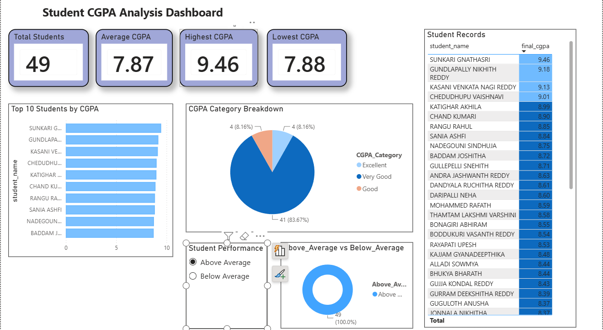
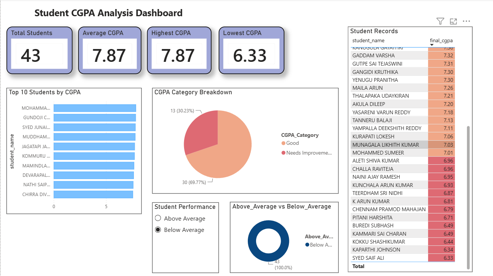
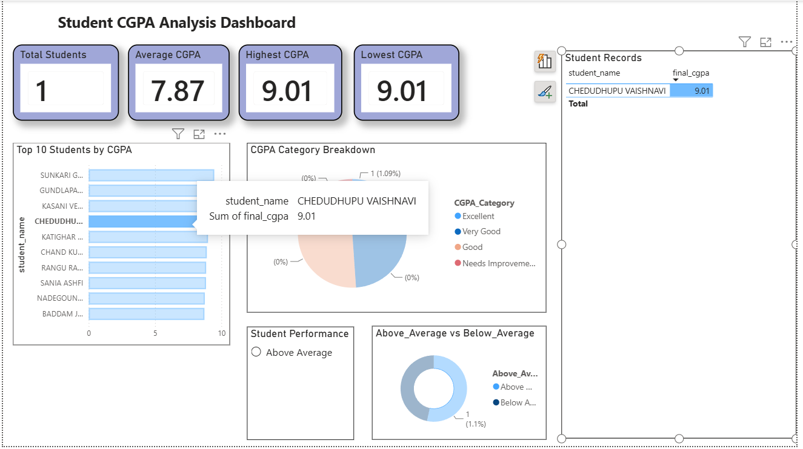
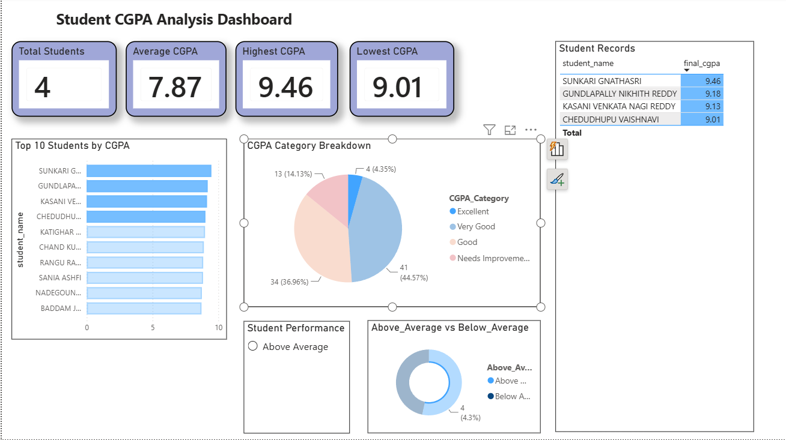

# 🎓 Student CGPA Analysis Dashboard

## 📌 Project Overview

This project is an interactive Power BI dashboard built to analyze student CGPA performance. It provides insights into student academic performance through KPIs, charts, and interactive filters.

---

## 📊 Dashboard Preview

### Main Dashboard

### Above Average Students

### Below Average Students

### Data View

---

## 📈 Dashboard Features

- Total Students KPI
- Average CGPA KPI
- Highest CGPA KPI
- Lowest CGPA KPI
- Top 10 Students by CGPA
- CGPA Category Breakdown
- Above Average vs Below Average Analysis
- Interactive Student Performance Slicer
- Student Records Table

---

## 🛠 Tools Used

- Power BI Desktop
- DAX (Data Analysis Expressions)
- Microsoft Excel

---

## 📚 DAX Measures Used

- Total Students
- Average CGPA
- Highest CGPA
- Lowest CGPA

---

## 📂 Dataset

The dataset contains:

- Student Name
- Hall Ticket Number
- Father Name
- Final CGPA

Additional calculated columns were created in Power BI using DAX:

- CGPA Category
- Above/Below Average
- Rank

---

## 💡 Key Insights

- Total Students: 92
- Average CGPA: 7.87
- Highest CGPA: 9.46
- Lowest CGPA: 6.33

---

## 🚀 Skills Demonstrated

- Data Cleaning
- Data Modeling
- DAX Calculations
- KPI Design
- Dashboard Design
- Interactive Filtering
- Data Visualization

---

## 👩‍💻 Author

**Vaishnavi Chedudhupu**

Aspiring Data Analyst
